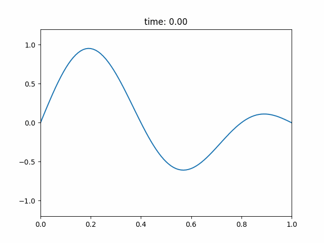
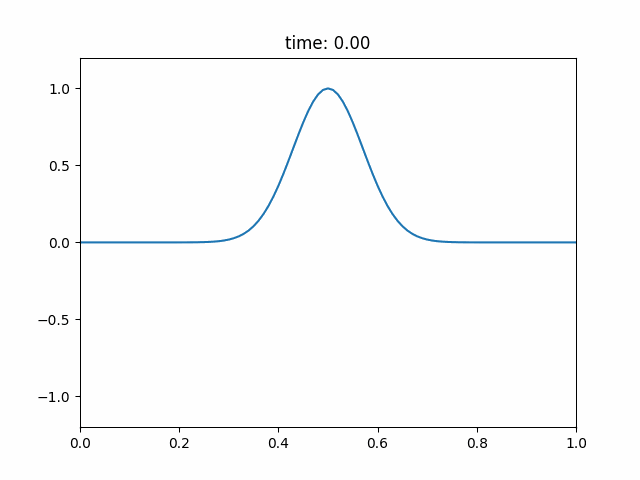

# Wave Simulation
The wave equation is a second-order linear partial differential equation for the description of waves or standing wave fields such as mechanical waves (e.g. water waves, sound waves and seismic waves) or electromagnetic waves (including light waves). It arises in fields like acoustics, electromagnetism, and fluid dynamics.  

The scalar wave equation is

$$\frac{\partial^2 \psi}{\partial t^2} = c^2 \nabla^2 \psi$$

where $c$ is the speed of the wave and $\nabla^2$ is the laplacian operation (the divergence of the gradient). More specifically, $\nabla^2$ can be written as the following in $n$ dimensions.

$$\nabla^2 \psi = \sum_{i=0}^n \frac{\partial^2 \psi}{\partial x_i^2}$$

In this project, I will use the finite-difference method to solve the wave equation and create a simulation for it in both 1 and 2 dimensions using python with a variety of different boundary conditions. But first, here's a quick introduction to discretization.

## Discretization

In applied mathematics, discretization is the process of transferring continuous functions, models, variables, and equations into discrete counterparts. To discretize our partial derivatives, let's first consider how we would descritze $\psi$ with respect to one variable. To do this, we first need to split $\psi$ into finite pieces of width $\Delta x$. When we do this, we'll get something like:

Discretization

If we want to find $\displaystyle\frac{d \psi}{dx} \Big|_{\displaystyle x_i} = \psi'(x_i)$, we can calculate the average slope of the two lines next to $x_i$. Doing this, we find that 

$$\psi'(x_i) = \frac{1}{2}\left( \frac{\psi(x_{i+1}) - \psi(x_i)}{\Delta x} + \frac{\psi(x_i) - \psi(x_{i-1})}{\Delta x} \right) = \frac{\psi(x_{i+1}) - \psi(x_{i-1})}{2 \Delta x}$$

Now, if we want to find $\displaystyle\frac{d^2 \psi}{dx^2} \Big|_{\displaystyle x_i} = \psi''(x_i)$, we can calculate the change in slope on the two lines next to $x_i$. Doing this, we find that

$$\psi''(x_i) = \frac{1}{\Delta x}\left( \frac{\psi(x_{i+1}) - \psi(x_i)}{\Delta x} - \frac{\psi(x_i) - \psi(x_{i-1})}{\Delta x} \right) = \frac{\psi(x_{i+1}) - 2\psi(x_i) + \psi(x_{i-1})}{\Delta x^2}$$

These two equations will give us what we need to apply the finite-difference method to the wave equation. Now, we're ready to solve the one dimensional wave equation.

## 1D Wave Equation

In one dimension, our wave equation becomes 

$$\frac{\partial^2 \psi}{\partial t^2} = c^2 \frac{\partial^2 \psi}{\partial x^2}$$

where $\psi$ is a function of both $t$ and $x$. In order to descritize $\psi$, I will write it as $\psi(t_i, x_j)$ where $x_j$ is a spatial coordinate and $t_i$ is a temporal coordinate. Applying the finite-difference method, we can turn the wave equation into

$$\frac{\psi(t_{i+1}, x_j) - 2\psi(t_i, x_j) + \psi(t_{i-1}, x_j)}{\Delta t^2} = c^2\frac{\psi(t_i, x_{j+1}) - 2\psi(t_i, x_j) + \psi(t_i, x_{j-1})}{\Delta x^2}$$

Our goal is to solve for $\psi(t_{i+1}, x_j)$ since we want to know what the next state of a cell is given it's previous states and the states of the cells nearby. To do this, we can simply rearrange our equation to get

$$\psi(t_{i+1}, x_j) = 2\psi(t_i, x_j) - \psi(t_{i-1}, x_j) + c^2\frac{\Delta t^2}{\Delta x^2} (\psi(t_i, x_{j+1}) - 2\psi(t_i, x_j) + \psi(t_i, x_{j-1}))$$

Hence, we have solved the wave equation in one dimension using the finite-difference method. Here's one such solution for the 1D wave function with a starting condition of a superposition of sine waves.

1D Sine Wave

One thing to note is that $C = c\displaystyle\frac{\Delta t}{\Delta x}$ term is call the Courant number and the Courant-Friedrichs-Lewy (CFL) condition requires that $C \le 1$ for numerical stability for this simulation. Here's an example of what happens if we let $C = 1.5$. As you can see, not very good things.

Numerical Instability (Bad)

Now let's solve the two dimensional wave equation using the finite difference method and applying the same ideas that we used here.

## 2D Wave Equation

In two dimensions, our wave equation becomes 

$$\frac{\partial^2 \psi}{\partial t^2} = c^2\left( \frac{\partial^2 \psi}{\partial x^2} + \frac{\partial^2 \psi}{\partial y^2} \right)$$

where $\psi$ is a function of $x$, $y$, and $t$. In order to save space since the equation becomes quite large, I will write $\psi(t_i, x_j, y_k)$ as $\psi_{i,j,k}$ where each subscript corresponds to their respective coordinate. Here, $x_j$ and $y_k$ are our spatial coordinates and $t_i$ is our temporal coordinate. Applying the finite-difference method, we can turn the wave equation into

$$\frac{\psi_{i+1,j,k} - 2\psi_{i,j,k} + \psi_{i-1,j,k}}{\Delta t^2} = c^2\left(\frac{\psi_{i,j+1,k} - 2\psi_{i,j,k} + \psi_{i,j-1,k}}{\Delta x^2} + \frac{\psi_{i,j,k+1} - 2\psi_{i,j,k} + \psi_{i,j,k-1}}{\Delta y^2} \right)$$

For this simulation, $\Delta x = \Delta y$ to keep things simple. Now let's use this substitution to turn our equation into 

$$\frac{\psi_{i+1,j,k} - 2\psi_{i,j,k} + \psi_{i-1,j,k}}{\Delta t^2} = c^2\frac{\psi_{i,j+1,k} + \psi_{i,j-1,k} + \psi_{i,j,k+1} + \psi_{i,j,k-1} - 4\psi_{i,j,k}}{\Delta x^2}$$

Our goal is still to solve for $\psi_{i+1,j,k}$ since we want to know what the next state of a cell is given it's previous states and the states of the cells nearby. To do this, we can simply rearrange our equation to get

$$\psi_{i+1,j,k} = 2\psi_{i,j,k} - \psi_{i-1,j,k} + c^2\frac{\Delta t^2}{\Delta x^2}(\psi_{i,j+1,k} + \psi_{i,j-1,k} + \psi_{i,j,k+1} + \psi_{i,j,k-1} - 4\psi_{i,j,k})$$

Hence, we have solved the wave equation in two dimensions using the finite-difference method. Here's one such solution for the 2D wave function with a starting condition of a 2D Gaussian.

2D Gaussian

## Damping

Now, let's solve the wave equation with damping by modifying the wave equation to include a damping term. This equation is given by

$$\frac{\partial^2 \psi}{\partial t^2} + \gamma \frac{\partial \psi}{\partial t} = c^2 \nabla^2 \psi$$

where $\gamma$ is the damping coefficient. Using the notation from the last part and the tools given to us by the finite-difference method, we can write this equation in one dimension as 

$$\frac{\psi_{i+1,j} - 2\psi_{i,j} + \psi_{i-1,j}}{\Delta t^2} + \gamma \frac{\psi_{i+1,j} - \psi_{i-1,j}}{2\Delta t} = c^2\frac{\psi_{i,j+1} - 2\psi_{i,j} + \psi_{i,j-1}}{\Delta x^2}$$

We can start simplifying this by combining the left side into one fraction. This gives us 

$$\frac{2\psi_{i+1,j} - 4\psi_{i,j} + 2\psi_{i-1,j} + \gamma \Delta t \psi_{i+1,j} - \gamma \Delta t \psi_{i-1,j}}{2\Delta t^2} = c^2\frac{\psi_{i,j+1} - 2\psi_{i,j} + \psi_{i,j-1}}{\Delta x^2}$$

Now, if we combine like terms on the left side, we get 

$$\frac{(2 + \gamma \Delta t)\psi_{i+1,j} - 4\psi_{i,j} + (2 - \gamma \Delta t)\psi_{i-1,j}}{2\Delta t^2} = c^2\frac{\psi_{i,j+1} - 2\psi_{i,j} + \psi_{i,j-1}}{\Delta x^2}$$

Our goal is still to solve for $\psi_{i+1,j}$ since we want to know what the next state of a cell is given it's previous state and the states of the cells nearby. To do this, we can simply rearrange our equation to get

$$\psi_{i+1,j} = \frac{1}{2 + \gamma \Delta t} \left( 4\psi_{i,j} - (2 - \gamma \Delta t)\psi_{i-1,j} + 2c^2\frac{\Delta t^2}{\Delta x^2}(\psi_{i,j+1} - 2\psi_{i,j} + \psi_{i,j-1}) \right)$$

Hence we have solved the 1D wave equation with damping. Here's the same example as before, but with $\gamma = 1$. Notice how the wave gets dampened over time. This is exactly the result we hoped for.

Damped Sine Wave

One thing to note is that if $\gamma = 0$, the $\frac{1}{2}$ at the start of the equation will cancel with the terms in the inside, giving us the original solution to the 1D wave equation. This confirms that our we did our math correctly.

## Boundary Conditions

If you were paying attention really closely, you might have noticed that the finite difference method doesn't tell us what to do at the boundaries. Let's take a look at the equations to see why.

$$\psi'(x_i) = \frac{\psi(x_{i+1}) - \psi(x_{i-1})}{2 \Delta x}$$

$$\psi''(x_i) = \frac{\psi(x_{i+1}) - 2\psi(x_i) + \psi(x_{i-1})}{\Delta x^2}$$

As it turns out, both the first and second derivatives rely on the cells before and after the cell we want to update. But what if there's no cell before, like the case of the first cell, or no cell after, like the case of the last cell. Turns out that there are many solutions to this problem, each with their own use case. I will demonstrate four such boundary conditions that are often used to solve this issue.

### Dirichlet Boundary Condition

This boundary condition, named after the German mathmatician Johann Peter Gustav Lejeune Dirichlet, is the one that I have been displaying in my examples so far. This boundary condition can be written explicitly as 

$$\psi \Big|_{\partial M} = 0$$

where $M$ is a manifold (the general term for surface) and $\partial M$ is the boundary of $M$. In one dimension $\partial M$ is at $x = 0$ and $x = L$ where $L$ is the length of the domain. The Dirichlet Boundary Condition takes the far simplest approach in my opinion, by just setting the boundaries to be zero so we can forget about them entirely.

### Neumann Boundary Condition

This boundary condition, named after John von Neumann, a Hungarian-American mathematician and physicist, was the most difficult to wrap my head around since it can be considerabley generalized. This condition is used when the rate of change of the wave function is known at the boundary. The most general form of this condition is 

$$\frac{\partial \psi}{\partial n} \Big|_{\partial M} = g(t)$$

where $\displaystyle\frac{\partial}{\partial n}$ is the outward pointing normal from a general boundary. In one dimension we have

$$\frac{\partial}{\partial n} \psi(L) = \frac{\partial}{\partial x} \psi(L),\ \ \frac{\partial}{\partial n} \psi(0) = -\frac{\partial}{\partial x} \psi(0)$$

Furthermore, $g(t)$ is the rate of the change of the wave function at the boundary. The simplest form of this boundary condition is when $g(t) = 0$, which is what I have implemented. In this case, there's no inward or outward flow and so the boundary cells will tend towards their neighboring cells.

In one dimension, this can be achieved by just setting the boundary cells to be equal to it's neighboring cell (Method 1), or you could have update the boundary cell to move towards its neighbor by cutting the distance between them in half with each time step (Method 2). The both achieve similar results as seen below, but the second method produces small waves on the left boundary which may not be desirable.

Method 1

Method 2

In two dimensions, we can't set the boundary cell to any one of it's neighbors since it it has multiple, so we have to use the second method of having it tend towards some average of the neighbors. [This article](https://folk.ntnu.no/leifh/teaching/tkt4140/._main056.html#kap:722) discusses one such way to do this using ghost cells around the boundary. However, it should be noted that they are applying it to the heat equation rather than the wave equation which is similar, but first order in time. Regardless, the Neumann boundary condition can be applied the same way. 

### Absorbing Boundary Condition (ABC)

ABCs are designed to simulate an open boundary where waves can exit the simulation domain without reflecting back. I guess the name should be pretty self explanatory. The equation for the ABC in one dimension is given by

$$\frac{\partial \psi}{\partial t} + c \frac{\partial \psi}{\partial n} = 0$$

Again, we can use the finite-difference method to solve this partial differential equation by slightly changing how we take the slope. Instead of taking the average of the slopes of the two lines around the boundary point, we'll just take the slope from the side that exists. For example, if you're on the left boundary, take the slope on the right side. Now let's apply this to the two boundaries in the 1D case

For the left boundary, 
$$\frac{\psi_{i+1, 0} - \psi_{i, 0}}{\Delta t} = c \frac{\psi_{i, 1} - \psi_{i, 0}}{\Delta x}$$
$$\psi_{i+1, 0} = \psi_{i, 0} + c\frac{\Delta t}{\Delta x}(\psi_{i, 1} - \psi_{i, 0})$$
For the right boundary, 
$$\frac{\psi_{i+1, -1} - \psi_{i, -1}}{\Delta t} = -c \frac{\psi_{i, -1} - \psi_{i, -2}}{\Delta x}$$
$$\psi_{i+1, -1} = \psi_{i, -1} - c\frac{\Delta t}{\Delta x}(\psi_{i, -1} - \psi_{i, -2})$$

where the negative indeces on the right boundary use python syntax to indicate how far from the right the cell is. For example, the $-1$ index is the rightmost cell.

There are two things to notice here. First, the signs flip for each boundary due to the fact that we need the oriented normal derivative of $\psi$. Second, I didn't use the usual finite-difference derivative for $\displaystyle \frac{\partial \psi}{\partial t}$ in order to avoid numerical instability. Instead, we take the change in $\psi$ from now to the next time step.

Now, to see this boundary condition in action, let's first take a look at the 1D Gaussian with Neumann boundary conditions and $\gamma = 0$ as a reference along with the 1D Gaussian with Absorbing Boundary Conditions and $\gamma = 0$.

Neumann

ABC

Despite the fact that $\gamma = 0$, the Absorbing Boundary Condition absorbs most of the incoming wave and only reflects a relatively small amount. Exactly what you would expect from the name.

### Periodic Boundary Condition

This is the last boundary condition that I'll explore here. The idea behind it is to connect opposite boundaries together so we can avoid the issue of not have a cell before and after. If there's no cell before, just use the last cell. If there's no cell after, use the first cell. Problem solved. Because of it's periodic nature, this boundary condition is useful for simulating wave phenomena in a closed loop or cyclic domain.

Thankfully, the math behind it is straightforward and it's as simple as 

$$\psi(0) = \psi(L), \ \ \frac{\partial}{\partial x} \psi(0) = \frac{\partial}{\partial x} \psi(L)$$

The discretization is also simple. Just use the equations supplied by the finite difference method and use the last cell if there's no cell before and the first cell if there's no cell after.

Now, let's simulate an off-center Gaussian with $\gamma = 0$ and Neumann boundary conditions for reference along with another simulation with the same setup but with Periodic boundary conditions.

Neumann

Periodic

As you can see, the wave loops back around and form a sort of periodicity in the simulation just as you would expect from the name. This is probably the next simplest boundary condition after Dirichlet. Of course, there are also other variations of this that impose slightly difference conditions to get different behaviors.

### Mixing Boundary Conditions

When applying boundary conditions, we aren't only confined to using one boundary condition. In fact, we could use a different condition on each boundary if we want. Here's an example of that using an off-center 2D Gaussian as the starting condition.

Mixed Boundary Conditions

In this simulation, $\gamma = 0$ and the boundary conditions are: Dirichlet on top, Neumann on the left, Absorbing on the right, and Periodic on the bottom boundary. As you can see, by combining all of these boundary conditions, we can get some complex behavior to arise and it looks pretty damn cool.

## Conclusion

Firstly, if you've made it to the end of this README, Thank You. This was just a small passion project that I found myself diving head-first into very quickly. It started when I was watching some Youtube videos on the wave equation when I thought, "I could probably make a simulation for that." And so I did my research and learned a lot of new things, diving into rabbit hole after rabbit hole while making this project. From Differential Equations to Quantum Mechanics, there's so much to explore with this topic. But most importantly, I find it amazing that we have techniques and the capability to create something as mesmerizing as a ripple in a pond.

This project only scratches the tip of the iceberg and there are many paths to go from here. Implementing different boundary conditions, adding obstacles, optimizing calculations, making the simulations interactive. These are just a few ideas on where to go from here. Thanks for reading.

## Works Cited
[Brian Sullivan - The Wave Equation & the Leapfrog Algorithm](https://www.youtube.com/watch?v=B4rziSNUpAA&list=PLN0b-Zk854ab6BHUQmI56WC1OLKPmwkY0)

[Nils Berglund - How to Simulate the Wave Equation](https://www.youtube.com/watch?v=pN-gi_omIVE&t=1631s)

[Numerical Methods for Engineers](https://folk.ntnu.no/leifh/teaching/tkt4140/._main056.html#kap:722)

[Reflecting Boundaries](https://hplgit.github.io/num-methods-for-PDEs/doc/pub/wave/html/._wave003.html)

[ChatGPT](https://chatgpt.com/)