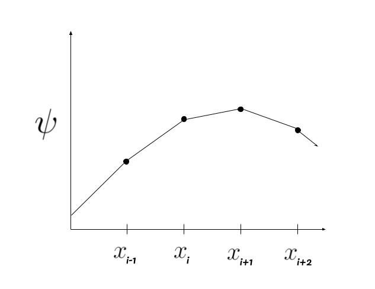
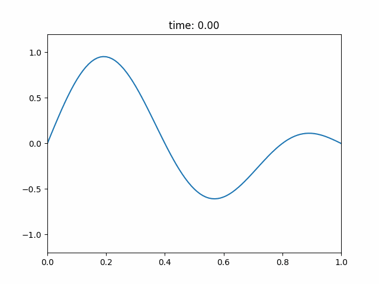

## Wave Simulation
The wave equation is a second-order linear partial differential equation for the description of waves or standing wave fields such as mechanical waves (e.g. water waves, sound waves and seismic waves) or electromagnetic waves (including light waves). It arises in fields like acoustics, electromagnetism, and fluid dynamics.  

The scalar wave equation is

$$\frac{\partial^2 \psi}{\partial t^2} = c^2 \nabla^2 \psi$$

where $c$ is the speed of the wave and $\nabla^2$ is the laplacian operation (the divergence of the gradient). More specifically, $\nabla^2$ can be written as the following in $n$ dimensions.

$$\nabla^2 \psi = \sum_{i=0}^n \frac{\partial^2 \psi}{\partial x_i^2}$$

In this project, I will use the finite-difference method to solve the wave equation and create a simulation for it in both 1 and 2 dimensions using python with a variety of different boundary conditions. But first, here's a quick introduction to discretization.

### Discretization

In applied mathematics, discretization is the process of transferring continuous functions, models, variables, and equations into discrete counterparts. To discretize our partial derivatives, let's first consider how we would descritze $\psi$ with respect to one variable. To do this, we first need to split $\psi$ into finite pieces of width $\Delta x$. When we do this, we'll get something like:

If we want to find $\displaystyle\frac{d \psi}{dx} \Big|_{\displaystyle x_i} = \psi'(x_i)$, we can calculate the average slope of the two lines next to $x_i$. Doing this, we find that 

$$\psi'(x_i) = \frac{1}{2}\left( \frac{\psi(x_{i+1}) - \psi(x_i)}{\Delta x} + \frac{\psi(x_i) - \psi(x_{i-1})}{\Delta x} \right)$$

$$ = \frac{\psi(x_{i+1}) - \psi(x_{i-1})}{2 \Delta x}$$

Now, if we want to find $\displaystyle\frac{d^2 \psi}{dx^2} \Big|_{\displaystyle x_i} = \psi''(x_i)$, we can calculate the change in slope on the two lines next to $x_i$. Doing this, we find that

$$\psi''(x_i) = \frac{1}{\Delta x}\left( \frac{\psi(x_{i+1}) - \psi(x_i)}{\Delta x} - \frac{\psi(x_i) - \psi(x_{i-1})}{\Delta x} \right)$$

$$ = \frac{\psi(x_{i+1}) - 2\psi(x_i) + \psi(x_{i-1})}{\Delta x^2}$$

These two equations will give us what we need to apply the finite-difference method to the wave equation. Now, we're ready to solve the one dimensional wave equation.

### 1D Wave Equation

In one dimension, our wave equation becomes 

$$\frac{\partial^2 \psi}{\partial t^2} = c^2 \frac{\partial^2 \psi}{\partial x^2}$$

where $\psi$ is a function of both $t$ and $x$. In order to descritize $\psi$, I will write it as $\psi(t_i, x_j)$ where $x_j$ is a spatial coordinate and $t_i$ is a temporal coordinate. Applying the finite-difference method, we can turn the wave equation into

$$\frac{\psi(t_{i+1}, x_j) - 2\psi(t_i, x_j) + \psi(t_{i-1}, x_j)}{\Delta t^2} = c^2\frac{\psi(t_i, x_{j+1}) - 2\psi(t_i, x_j) + \psi(t_i, x_{j-1})}{\Delta x^2}$$

Our goal is to solve for $\psi(t_{i+1}, x_j)$ since we want to know what the next state of a cell is given it's previous states and the states of the cells nearby. To do this, we can simply rearrange our equation to get

$$\psi(t_{i+1}, x_j) = 2\psi(t_i, x_j) - \psi(t_{i-1}, x_j) + c^2\frac{\Delta t^2}{\Delta x^2} (\psi(t_i, x_{j+1}) - 2\psi(t_i, x_j) + \psi(t_i, x_{j-1}))$$

Hence, we have solved the wave equation in one dimension using the finite-difference method. Here's one such solution for the 1D wave function with a starting condition of a superposition of sine waves.

One thing to note is that $C = c\displaystyle\frac{\Delta t}{\Delta x}$ term is call the Courant number and the Courant-Friedrichs-Lewy (CFL) condition requires that $C \le 1$ for numerical stability for this simulation.

Now let's solve the two dimensional wave equation using the finite difference method and applying the same ideas that we used here.

### 2D Wave Equation

In two dimensions, our wave equation becomes 

$$\frac{\partial^2 \psi}{\partial t^2} = c^2\left( \frac{\partial^2 \psi}{\partial x^2} + \frac{\partial^2 \psi}{\partial y^2} \right)$$

where $\psi$ is a function of $x$, $y$, and $t$. In order to save space since the equation becomes quite large, I will write $\psi(t_i, x_j, y_k)$ as $\psi_{i,j,k}$ where each subscript corresponds to their respective coordinate. Here, $x_j$ and $y_k$ are our spatial coordinates and $t_i$ is our temporal coordinate. Applying the finite-difference method, we can turn the wave equation into

$$\frac{\psi_{i+1,j,k} - 2\psi_{i,j,k} + \psi_{i-1,j,k}}{\Delta t^2} = c^2\left(\frac{\psi_{i,j+1,k} - 2\psi_{i,j,k} + \psi_{i,j-1,k}}{\Delta x^2} + \frac{\psi_{i,j,k+1} - 2\psi_{i,j,k} + \psi_{i,j,k-1}}{\Delta y^2} \right)$$

For this simulation, $\Delta x = \Delta y$ to keep things simple. Now let's use this substitution to turn our equation into 

$$\frac{\psi_{i+1,j,k} - 2\psi_{i,j,k} + \psi_{i-1,j,k}}{\Delta t^2} = c^2\frac{\psi_{i,j+1,k} + \psi_{i,j-1,k} + \psi_{i,j,k+1} + \psi_{i,j,k-1} - 4\psi_{i,j,k}}{\Delta x^2}$$

Our goal is still to solve for $\psi_{i+1,j,k}$ since we want to know what the next state of a cell is given it's previous states and the states of the cells nearby. To do this, we can simply rearrange our equation to get

$$\psi_{i+1,j,k} = 2\psi_{i,j,k} - \psi_{i-1,j,k} + c^2\frac{\Delta t^2}{\Delta x^2}(\psi_{i,j+1,k} + \psi_{i,j-1,k} + \psi_{i,j,k+1} + \psi_{i,j,k-1} - 4\psi_{i,j,k})$$

Hence, we have solved the wave equation in two dimensions using the finite-difference method. Here's one such solution for the 2D wave function with a starting condition of a 2D Gaussian.

### Damping

Now, let's solve the wave equation with damping by modifying the wave equation to include a damping term. This equation is given by

$$\frac{\partial^2 \psi}{\partial t^2} + \gamma \frac{\partial \psi}{\partial t} = c^2 \nabla^2 \psi$$

where $\gamma$ is the damping coefficient. Let's start in one dimension. Using the notation from the last part and the tools given to us by the finite-difference method, we can write this equation as 

$$\frac{\psi_{i+1,j} - 2\psi_{i,j} + \psi_{i-1,j}}{\Delta t^2} + \gamma \frac{\psi_{i+1,j} - \psi_{i-1,j}}{2\Delta t} = c^2\frac{\psi_{i,j+1} - 2\psi_{i,j} + \psi_{i,j-1}}{\Delta x^2}$$

We can start simplifying this by combining the left side into one fraction. This gives us 

$$\frac{2\psi_{i+1,j} - 4\psi_{i,j} + 2\psi_{i-1,j} + \gamma\psi_{i+1,j} - \gamma\psi_{i-1,j}}{2\Delta t^2} = c^2\frac{\psi_{i,j+1} - 2\psi_{i,j} + \psi_{i,j-1}}{\Delta x^2}$$

Now, if we combine like terms on the left side, we get 

$$\frac{(2 + \gamma)\psi_{i+1,j} - 4\psi_{i,j} + (2 - \gamma)\psi_{i-1,j}}{2\Delta t^2} = c^2\frac{\psi_{i,j+1} - 2\psi_{i,j} + \psi_{i,j-1}}{\Delta x^2}$$

Our goal is still to solve for $\psi_{i+1,j}$ since we want to know what the next state of a cell is given it's previous state and the states of the cells nearby. To do this, we can simply rearrange our equation to get

$$\psi_{i+1,j} = \frac{1}{2 + \gamma} \left( 4\psi_{i,j} - (2 - \gamma)\psi_{i-1,j} + 2c^2\frac{\Delta t^2}{\Delta x^2}(\psi_{i,j+1} - 2\psi_{i,j} + \psi_{i,j-1}) \right)$$

Hence we have solved the 1D wave equation with damping. Here's the same example as before, but with $\gamma = 1$. Notice how the wave gets dampened over time. This is exactly the result we hoped for.

One thing to note is that if $\gamma = 0$, the $\frac{1}{2}$ at the start of the equation will cancel with the terms in the inside, giving us the original solution to the 1D wave equation. This confirms that our we did our math correct and that we didn't just get a whole different equation. That would be bad, probably.